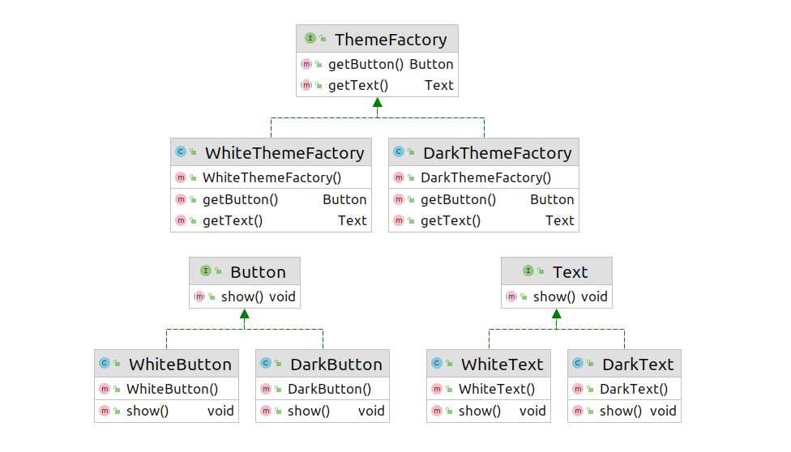

## Abstract Factory 

Factory আর Abstract Factory  এর মধ্যে প্রধান পার্থক্য হল ফাক্টরি মেথড যাস্ট একটা প্রোডাক্ট
রিটার্ন করে আর এবস্ট্রাক্ট ফ্যাক্টরি একটা গ্রুপ ওফ প্রোডাক্ট রিটার্ন করে। 

যেমন ডার্ক থিক ও লাইট থিম ধরা যায় । ডার্ক থিম নিলে ডার্ক থিমের ফ্যাক্টরি ডার্ক বাটন ও 
হোয়াইট টেক্সট রিটার্ন করবে, ভাইস ভার্সা। 

**Button:**
```java
public interface Button {
    void show();
}
```

```java
public class DarkButton implements Button{
    @Override
    public void show() {
        System.out.println("Dark Button!");
    }
}
```
```java
public class WhiteButton implements Button{
    @Override
    public void show() {
        System.out.println("White Button!");
    }
}
```
**Text:**
```java
public interface Text{
    void show();
}

```
```java
public class DarkText implements Text{
    @Override
    public void show() {
        System.out.println("Dark Text!");
    }
}
```
```java
public class WhiteText implements Text{
    @Override
    public void show() {
        System.out.println("White Text!");
    }
}
```
**Creating themes:**
```java
public interface ThemeFactory {
    Button getButton();
    Text getText();
}
```
```java
public class DarkThemeFactory implements ThemeFactory{
    @Override
    public Button getButton() {
        return new DarkButton();
    }

    @Override
    public Text getText() {
        return new WhiteText();
    }
}
```
```java
public class WhiteThemeFactory implements ThemeFactory{
    @Override
    public Button getButton() {
        return new WhiteButton();
    }

    @Override
    public Text getText() {
        return new DarkText();
    }
}
```
**For switching themes:**
```java
public class ThemeLoader {

    ThemeFactory themeFactory=null;

    public ThemeLoader()
    {

    }

    void setThemeFactory(ThemeFactory themeFactory)
    {
        this.themeFactory=themeFactory;
    }

    void showTheme()
    {
        if (themeFactory==null)
        {
            System.out.println("No Theme Has been Set!");
            return;
        }

        themeFactory.getButton().show();
        themeFactory.getText().show();

    }


}
```
**Main Method:**
```java
public class AbstractFactoryMain {
    public static void main(String[] args) {
        ThemeLoader themeLoader=new ThemeLoader();

        themeLoader.setThemeFactory(new WhiteThemeFactory());
        themeLoader.showTheme();

        themeLoader.setThemeFactory(new DarkThemeFactory());
        themeLoader.showTheme();
    }
}
```