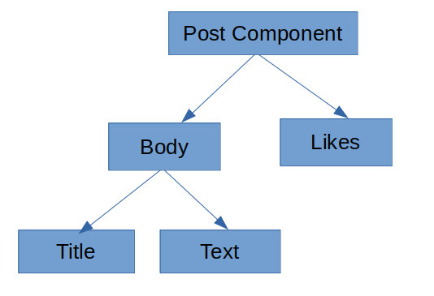
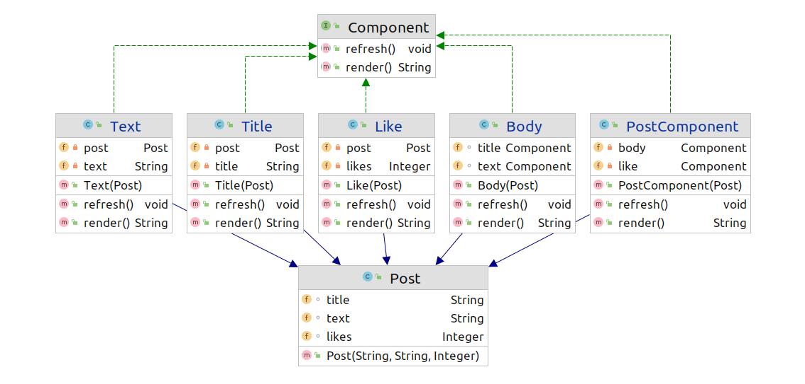

## Composite Pattern

কম্পোজিট প্যাটার্ন তখন কাজে আসবে যদি আমারাদের ক্লাস গুলা কে ট্রি এর মাধ্যমে ডিফাইন করা যায়। 

ধরি আমরা একটা পোস্ট UI তে দেখাতে চাই , যখন পোস্টের কোন কিছু আপডেট হবে তখন প্যরেন্ট কম্পোনেন্ট
কল করলেই যাতে আপডেট লিফ নোডে চলে যায় , 

এইখানে রিফ্রেশ এর কাজ হল রিফ্রেশ করার আর রেন্ডার কাজ হল HTML ফর্মেটে ফেরত দেয়া ,

```java
public class CompositeMain {
    public static void main(String[] args) {
        Post post=new Post(
                "ডিজাইন প্যটার্ন" ,
                "এইখানে আমরা ডিজাইন প্যটার্ন নিয়ে আলোচনা করব",
                12
                );
        Component component=new PostComponent(post);
        System.out.println(component.render());
        post.likes=15;
        component.refresh();
        System.out.println(component.render());
    }
}
```
আউটপুটে লাইক পরিবর্তন হয়েছে 

```
<div>
<div>
<h1>ডিজাইন প্যটার্ন</h1>
<pre>এইখানে আমরা ডিজাইন প্যটার্ন নিয়ে আলোচনা করব</pre>
</div>

<p> Likes: 12</p>
</div>

<div>
<div>
<h1>ডিজাইন প্যটার্ন</h1>
<pre>এইখানে আমরা ডিজাইন প্যটার্ন নিয়ে আলোচনা করব</pre>
</div>

<p> Likes: 15</p>
</div>
```

```java
public interface Component {
    void refresh();
    String render();
}
```
```java
public class PostComponent implements Component{

    private  Component body;
    private  Component like;

    public PostComponent(Post post)
    {
        this.body=new Body(post);
        this.like=new Like(post);
    }

    @Override
    public void refresh() {
        body.refresh();
        like.refresh();
    }

    @Override
    public String render() {
        return "<div>\n" +
                body.render()+"\n"+
                like.render()+"\n"+
                "</div>\n";
    }
}
```
```java
public class Body implements Component{

    Component title;
    Component text;

    public Body(Post post)
    {
        this.title=new Title(post);
        this.text=new Text(post);
    }

    @Override
    public void refresh() {
        title.refresh();
        text.refresh();
    }

    @Override
    public String render() {
        return "<div>\n" +
                title.render()+"\n"+
                text.render()+"\n"+
                "</div>\n";
    }
}
```
```java
public class Title implements Component{

    private Post post;
    private String title;

    public Title(Post post)
    {
        this.post=post;
        this.title=this.post.title;
    }

    @Override
    public void refresh() {
        this.title=this.post.title;
    }

    @Override
    public String render() {
        return "<h1>"+title+"</h1>";
    }
}
```
```java
public class Text implements Component{

    private Post post;
    private String text;

    public Text(Post post)
    {
        this.post=post;
        this.text=post.text;
    }

    @Override
    public void refresh() {
        this.text=post.text;
    }

    @Override
    public String render() {
        return "<pre>"+this.text+"</pre>";
    }
}
```
```java
public class Like implements Component{

    private Post post;
    private Integer likes;
    public Like(Post post)
    {
        this.post=post;
        this.likes=post.likes;
    }

    @Override
    public void refresh() {
        this.likes=post.likes;
    }

    @Override
    public String render() {
        return "<p> Likes: "+this.likes+"</p>";
    }
}
```
এইখানে বেশ কয়েক যায়গায় ডিপেন্ডেন্সি ইনভার্শন প্রিন্সিপাল ব্রেক করছি যাস্ট সিম্পল রাখার জন্য , যেমন পোস্টে বডি কল না করে ডিপেন্ডেন্সি ইঞ্জেকশন করে করা যেত , আর পোস্ট
কম্পোনেন্ট ক্রিয়েট করার জন্য একতা ফ্যাক্টরি রাখা যেত।