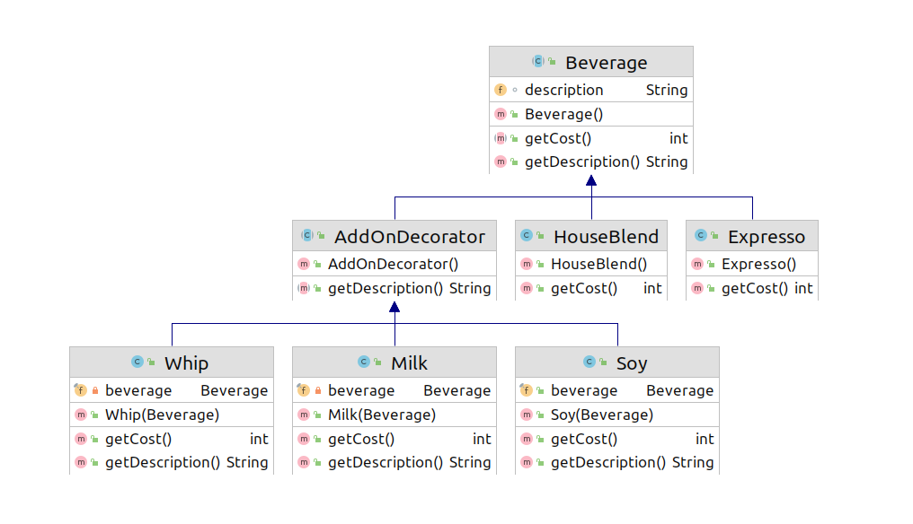
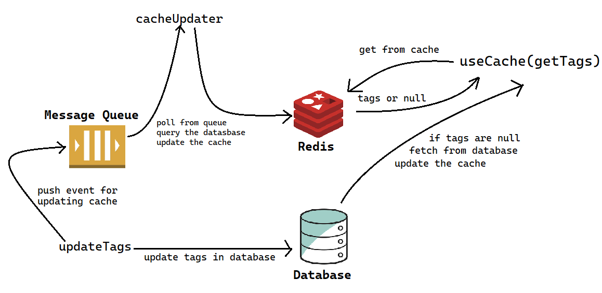

# Decorator Pattern
Decorator pattern এর কাজ হল বিহেভিওয়ার দেয়া সেটা হতে পারে ক্লাসের অবজেক্ট বা একটা ফাংশন।

এই প্যাটার্ন কখন কাজে আসে তার একটা এবস্ট্রাক্ট আইডিয়া বুজা যাক।ধরুন আমরা কফি বানাব এখন কফি এর অনেক ধরন আছে (Expresso, HouseBlend)।এখন চাইলে আমরা চাইলে আমাদের কফির সাথে Milk, Whip, Soy নিতে পারি। এখন চাইলে কেও মিল্ক নিতেও পারে নাও পারে, আবার আগে Milk নিয়ে এরপর Soy নিতে পারে। ঠিক এইসব ক্ষেত্রে Decorator Pattern সাহায্য করে।

```java
public static void main(String[] args) {
    Beverage coffeeA= new Milk(new Soy(new Expresso()));
    Beverage coffeeB= new Soy(new Whip(new Milk(new HouseBlend())));

    System.out.println(coffeeA.getCost());
    System.out.println(coffeeA.getDescription());

    System.out.println(coffeeB.getCost());
    System.out.println(coffeeB.getDescription());
}
```

## Beverage(coffee):

```java
public abstract class Beverage {
    String description="Unknown Beverage";
    public String getDescription() {
        return description;
    }
    public abstract int getCost();
}
```
### Expresso:
```java
public class Expresso extends Beverage {
    public Expresso(){
        super.description="Expresso";
    }

    @Override
    public int getCost() {
        return 1;
    }
}
```
### HouseBlend:
```java
public class HouseBlend extends Beverage{

    public HouseBlend() {
        super.description="House Blend";
    }

    @Override
    public int getCost() {
        return 2;
    }
}
```
## Add on:
```java
public abstract class AddOnDecorator extends Beverage {
    public abstract String getDescription();
}
```
### Milk: 
```java
public class Milk extends AddOnDecorator{

    private final Beverage beverage;

    public Milk(Beverage beverage) {
        this.beverage=beverage;
    }

    @Override
    public int getCost() {
        return beverage.getCost()+1;
    }

    @Override
    public String getDescription() {
        return beverage.getDescription()+" with Milk";
    }
}
```
### Soy:
```java
public class Soy extends AddOnDecorator{

    public final Beverage beverage;

    public Soy(Beverage beverage) {
        this.beverage=beverage;
    }

    @Override
    public int getCost() {
        return beverage.getCost()+2;
    }

    @Override
    public String getDescription() {
        return beverage.getDescription()+" added Soy";
    }
}
```
### Whip:
```java
public class Whip extends AddOnDecorator{
    private final Beverage beverage;

    public Whip(Beverage beverage) {
        this.beverage=beverage;
    }

    @Override
    public int getCost() {
        return this.beverage.getCost()+3;
    }

    @Override
    public String getDescription() {
        return this.beverage.getDescription()+" added Whip";
    }
}
```

এইখানে লক্ষ করার বিষয় যে ডেকরেক্টর কন্সট্রাক্টর এর রিটার্ন পরিবর্তন করে নি। এইটা Milk, Soy এড করে কফি(Beverage) এই রিটার্ন করেছে।

এবস্ট্রাক্ট আইডিইয়া পাওয়া গেল ডেকোরেটর প্যাটার্ন কি কাজ করে এখন এর কিছু ব্যবহার দেখা যাক।

## Chat app Websocket Message Handling:

ধরেন আপনি চ্যাট এপ বানাচ্ছেন ReactJs দিয়ে যেখানে চাট এপ এর ডাটা দুই ভাবে আসে HTTP  এবং WebSocket দিয়ে।এপ যখন প্রথমে লোড হয় তখন ডাটা আসে HTTP GET মেথড দিয়ে আর এরপর থেকে লাইভ আপডেট হয় WebSocket দিয়ে তো কম্পোনেন্ট কিভাবে স্টেট আপডেট করবেন।

এখন state আপডেট করার জন্য আপনি HTTP এর API কল এর জন্য আলাদা মেথড রাখতে পারেন আর websocket এর জন্য আলাদা মেথড করতে পারেন। এইটা কাজ করবে কিন্তু প্রচুর কোড ডুপ্লিকেট কোড থাকবে। আবার ধরেন ভবিষ্যতে কিছু চেঞ্জ হল, ধরেন অন্য কেও আরেকটা কম্পোনেন্ট এ আপনার লেখা এই কম্পোনেন্টটা ব্যাবহার করতে চাইল আর যখন নতুন মেসেজ আসে তখন ওই Component থেকে একটা পাঠানো ফাংশন কল করতে বলল। তখন তাকে আপনার লেখা কম্পোনেন্ট এ WebSocket এবং HTTP দুইখানেই আপডেট করা লাগবে।তখন কোন একজায়গায় এড করতে ভুলে গেলে বাগ তৈরি হবে কোডে। এখন একটা ইভেন্ট বললাম রিয়েল লাইফ এ এমন অনেক ইভেন্ট কোডে থাকবে।

এখন ধরুন আপনি একটি গ্রুপ চ্যাটে মেসেজ পাঠাইছেন এইটা যদি websocket দিয়ে group এর মধ্যে ব্রডকাস্ট করলেন। এখন আপনার ফ্রন্ট এন্ডে যখন ওয়েব সকেট দিয়ে মেসেজ আসবে তখন আপনার ফিল্টার করে দেখতে হবে এই মেসেজ অলরেডি আপনার মেসেজ লিস্ট এ আছে কিনা যদি থাকে তাহলে আর লিস্ট এড করবেন না। এখন আরেকটা আইডিয়া হতে পারে ব্যাকএন্ড থেকে নিজের মেসেজ নিজের কাছে পাঠালেন না কিন্তু এই ক্ষেত্রে ইউজার যদি মাল্টিপল ট্যাব খুলে রাখে তাহলে ট্যাব গুলার মধ্যে মেসেজ Sync করবেন কিভাবে? এখন আপনার websocket দিয়ে state আপডেট করার মেথডে আপনি ফিল্টার করে state আপডেট করলেন। এখন আপনি websocket দিয়ে মেসাজ ডিলেট ও ইমুজি রিএকশন দেয়া ও পুশ করলেন, তখন আপনার ওইসব যায়গায় ও ফিল্টার এড করা লাগবে।

এইটা এখন সুস্পষ্ট ভাবে দেখাই যাচ্ছে আলাদা মেথড দিয়ে করলে কত ধরনের ঝামেলা ইন্ট্রোডিউস হতে পারে।এখন দেখা যাক ডেকোরেটর দিয়ে এইটা কিভাভে সল্ভ করবেন।

```javascript
const ChatComponent = ({ onMessage, onMessageDelete })=>{

    const [messages, setMessages] = useState({});

    useEffect(()=>{
        chatService
            .getMessages()
            .then((messages) => setMessages(messages))
            .catch(showNetworkError);
    },[]);

    useEffect(()=>{

        // this is the decorator function which will  decorate  handlers  to
        // handle websocket messages also responsible for filtering messages
        // all the stuff related to web-socket will be handled by this function
        const proccessAsWebSocketEvent = (processFunction) => {
            return (webSocketEvent) => {
                const { message: newMessage, opreation } = webSocketEvent;
                const isMessageAlreadyPresent = messages.find(message => newMessage._id===message._id);
                if(!isMessageAlreadyPresent && operation !== 'message|deleted'){
                    return processFunction(newMessage);
                }
                else{
                    return processFunction(newMessage);
                }
            };
        };

        const webSocketListener = (webSocketEvent)=>{
            const { operation } = webSocketEvent;
            const operationProcessors = {
                'message|added' : proccessAsWebSocketEvent(handleMessageAdd),
                'message|deleted' : proccessAsWebSocketEvent(handleMessageDelete), 
            };
            operationProcessors[operation](webSocketEvent)
        };

        webSocketService.attachListener(webSocketListener);
    },[handleMessageAdd, handleMessageDelete]);    

    const handleMessageAdd = useCallback((newMessage) => {
        setMessages([newMessage, ...messages]);
        onMessage(newMessage);
    });

    const handleMessageDelete = useCallback((deletedMessage) => {
        setMessages([
            ...messages.filter(message=> message._id !== deletedMessage._id)
        ]);
        onMessageDelete(deletedMessage)
    });
    
    return (
        <>
            <MessageInput onMessageAdd={handleMessageAdd}/>
            {messages.length > 0 && messages.map(
                (message) => <MessageContent message={message} onMessageDelete={handleMessageDelete}/>
            )
        </>)};
}

```

## Caching: 

Decorator প্যাটার্নের আরেকটা ব্যাবহার হল ক্যাশিং করার ক্ষেত্রে, উদাহারনস্বরূপ আমাদের মিডিয়াম এর মত ব্লগ সাইট আছে এবং প্রত্যেক পোস্টে ট্যাগ এড করা যায় এখন ট্যাগ এর লিস্ট বিশাল তাই প্রত্যেকবার ডাটাবেস থেকে সব গুলো ট্যাগ বের করা অনেক কস্টলি(2-3 second)। এই ক্ষেত্রে আমারা ট্যাগ গুলা বের করে রেডিসে রেখে দিতে পারি এরপর ইউজার কল করলে ওইখান থেকে সার্ভ করতে পারি। তো ক্যাশিং করার জন্যা যেই ফাংশন দিতে ট্যাগ গুলা ফেচ করতেছি ওই ফাংশন কে মোডিফাই করতে পারি ক্যাশ ব্যবহার জন্য।এই ক্ষেত্রে যেটা হতে পারে ভবিষ্যত এ আমাদের ট্যাগ বাদে আরো আন্য কিছু ক্যাশ করা লাগল তখন আমাদের ম্যানুয়ালি প্রত্যেক ফাংশনের জন্য করা লাগবে। আবার আরেকটা কেস হতে পারে, আমাদের ইউজার কে দেয়ার সময় একবারে রিসেন্ট ট্যাগ লিস্ট না দিলেও চলে। অর্থাৎ আমরা চাইলে আমাদের রেডিস ক্যাস কে এসিনক্রোনাসলি আপডেট করতে পারি নিচের ডায়ারগ্রাম এর মত।


আমাদের ট্যাগ লিস্ট ডাটাবেসে যখন আপডেট আসবে তখন আমরা একটা Queue তে একটা মেসেজ প্রডিউস করব এরপর একটা Consumer ডাটাবেস থেকে সবগুলা ট্যাগ ফেচ করে আপডেট করে দিবে।

এই অবস্থায় যদি আমরা ওই মেথড টাকে মডিফাই করে ক্যাশ এড করি প্রবলেম হতে পারে, কারন অন্যকোন মাইক্রোসার্ভিস হয়ত এই মেথড কল করে ট্যাগ গুলা নেয় এবং সেই মাইক্রোসার্ভিস এর একবারে আপডেটেড ট্যাগ গুলা প্রয়োজন। তখন ওই সার্ভিস আপডেটেড ট্যাগ গুলা পাবে না।

```python
import time


# Mock implementation of Redis Cache

class Redis:
    def __init__(self):
        self.cache = {}

    def set(self, key, value):
        self.cache[key] = value

    def get(self, key, default=None):
        return self.cache.get(key, default)


redis = Redis()


# perform some queries to retrieve tags from database,
# and it takes about 3 second to complete

def get_tags():
    time.sleep(3)
    return ['beef', 'sandwich', 'vegetables', 'food']


def use_cache(func_to_cache):
    def cached_function(*args, **kwargs):
        tags = redis.get('post_tags')
        if tags is None:
            tags = func_to_cache(*args, **kwargs)
            redis.set('post_tags', tags)
        return tags

    return cached_function


cached_get_tags = use_cache(get_tags)

for i in range(1,4):
    print('getting tags:')
    start = time.time()
    print('tags are:', cached_get_tags())
    end = time.time()
    print('time taken: ',end - start)
```
output: 
```
getting tags:
tags are: ['beef', 'sandwich', 'vegetables', 'food']
time taken:  3.014481782913208
getting tags:
tags are: ['beef', 'sandwich', 'vegetables', 'food']
time taken:  0.0
getting tags:
tags are: ['beef', 'sandwich', 'vegetables', 'food']
time taken:  0.0
```

এইবার দেখা যাবে প্রথম ফাংশনটা ডাটাবেস থেকে ডাটা পুল করে আনছে তাই স্লো এক্সিকিউট হচ্ছে পরের গুলা ক্যাশ থেকে আসছে তাই দ্রুত এক্সিকিউট হচ্চে।

python decorator এর জন্য একটি syntactic sugar প্রোভাইড করে, নিচের দুইটা রিপ্রেজেন্ট্রেশন একই।

```python
cached_get_tags = use_cache(get_tags)
```
```python
@use_cache
def cached_get_tags():
    return get_tags()
```

এখন আমারা use_cache ফাংশনটা দিয়ে যেকোন ফাংশনকে decorate করলেই cached হয়ে যাবে। কিন্তু এইখানে সমস্যা একটাই রেডিস এ যে key দিয়ে স্টোর হচ্ছে ওইটা হার্ড কোড করা।ওই key কে ফাংশনের প্যারামিটার হিসেবে পাঠাতে হবে,

```python
def use_cache(key):
    def cache_with_redis(func_to_cache):
        def cached_function(*args, **kwargs):
            tags = redis.get(key)
            if tags is None:
                tags = func_to_cache(*args, **kwargs)
                redis.set(key, tags)
            return tags
        return cached_function
    return cache_with_redis
```
এখন ডেকোরেটরটাকে এইভাবে এপ্লাই করতে পারি,
```python
cached_get_tags = use_cache('post_tags')(get_tags)
```
or
```python
@use_cache('post_tags')
def cached_get_tags():
    return get_tags()
```
অনেক ফ্রেমওয়ার্ক পাইথনের এই ডেকোরেটর উপর বেস করে বানানো হয়েছে।