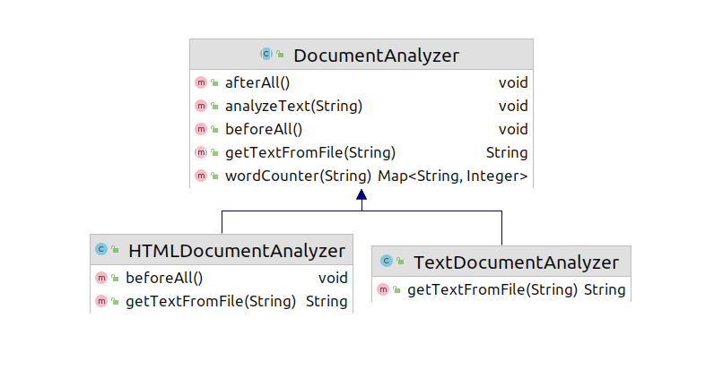

## Template Method Pattern

Template method pattern তখন ই আমরা ব্যবহার করি যদি আমাদের কোন এলগোরিদম 
ব্যাবহার করা লাগে ও এলগোরিদম কমন কিছু স্টেপ থাকে , তখন আমরা এলগোরিদম টা কে 
সাবস্টেপে ভেঙে ফেলি। উদাহারন দিলে সহজে বুজা যাবে, আমরা একটা
ডকুমেন্ট এনালাইজার এর কথা ধরা যাক যেতার  অনেক সিম্পল একটা ডকুমেন্ট এর ওয়ার্ড এর ফ্রিকুয়েন্সি
কাউন্ট করে। তো প্রথম আমরা এইটা সিম্পল টেক্সট ফাইল এর জন্য করালাম, তারপর আমরা এইটা পিডিএফ
ফাইল এর জন্য করালাম এরপর ডক এর জন্য করালাম। করার পরে দেখা যাবে যে কিছু স্টেপ কমন,
বিশেষ করে ওয়ার্ড কাউন্ট এর এর পার্ট টা এই জন্য । আবার ক্লায়েন্ট (যে কোড টা ব্যবহার করবে) 
কে কোন ডকুমেন্ট নিয়ে কাজ করতেছে তা নিয়ে কনসার্ন থাকা লাগবে কারন ডকুমেন্টওয়াইজ কোন
এবাস্ট্রাকশন নাই। এই সমস্যা সমাধান করার জন্য টেপমপ্লেট ডিজাইন প্যটার্ন আসছে। কমন জিনিস গুলা আমরা
একটা এবস্ট্রাকট ক্লাসে রেখে দিতে পারি, আর কিছু মেথড এবসট্রাকট করে রাখতে পারি। 

আমরা হুক ও এড করতে পারি হুক হল এম্পটি মেথড যেটা ইমপ্লিমেন্ট করা ছাড়াও এলগোরিদম কাজ করবে, যেমন একটা
এম্পটি মেথড রাখা যায় `BeforeAll()` এই মেথডটা কল হবে সব মেথডের আগে ,ক্লায়েন্ট যদি কোন প্রসেসিং না 
করতে চায় শুরুতে এইটাকে খালি রেখে দিলেই হবে। 




```java
public abstract class DocumentAnalyzer {

    /*----------hooks----------*/
    public void beforeAll(){};
    public void afterAll(){};
    /*-------------------------*/

    public abstract String  getTextFromFile(String filePath);


    public Map<String,Integer> wordCounter(String text)
    {
        String[] words=text.split(" ");
        Map<String,Integer> counter=new HashMap<>();
        Arrays.asList(words)
                .forEach(word->counter.put(word,counter.getOrDefault(word,0)+1));
        return counter;
    }

    public void analyzeText(String filePath)
    {
        beforeAll();
        String text=getTextFromFile(filePath);
        text=text.replaceAll("s+|\n"," ");
        Map<String,Integer> counts=wordCounter(text);
        counts.keySet().forEach(key->System.out.println(key + "->"+counts.get(key)));
        afterAll();
    }
    
}
```
```java
public class HTMLDocumentAnalyzer extends DocumentAnalyzer{
    @Override
    public String getTextFromFile(String filePath) {
        String text="";
        try(Scanner scanner=new Scanner(new File(filePath)))
        {
            while (scanner.hasNextLine()) text+=scanner.nextLine();
        } catch (FileNotFoundException e) {
            e.printStackTrace();
        }
        //Removing the HTML text
        text=text.replaceAll("<[a-z]+>|<\\/[a-z]+>","");
        return text;
    }

    @Override
    public void beforeAll() {
        System.out.println("Processing a HTML Document!");
    }
}
```
```java
public class TextDocumentAnalyzer extends DocumentAnalyzer{
    @Override
    public String getTextFromFile(String filePath) {
        String text="";
        try(Scanner scanner=new Scanner(new File(filePath)))
        {
            while (scanner.hasNextLine()) text+=scanner.nextLine();
        } catch (FileNotFoundException e) {
            e.printStackTrace();
        }
        return text;
    }
}
```
```java
public class TemplateMain {

    public static void main(String[] args) {
        DocumentAnalyzer htmlDocumentAnalyzer=new HTMLDocumentAnalyzer();
        htmlDocumentAnalyzer.analyzeText("src/templateMethodPattern/sonar_tori.html");

        DocumentAnalyzer textDocumentAnalyzer=new TextDocumentAnalyzer();
        textDocumentAnalyzer.analyzeText("src/templateMethodPattern/kobor_kobita.txt");
    }

}
```
output:
```
Processing a HTML Document!
এল->1
দেখি->1
উহারে।->1
কাটা->1
তরণী-'পরে।->1
সে->1
ঘন->2
...
বেদনার->1
হারা->1
মা,চোখের->1
হয়ে->1
আবিরের->1
স্নেহের->1
নয়নের->3
নিতে->1
...

```

এইখানে ফাইল রিডিং এর পার্টটা একই স্ক্যনার দিয়ে করছি দুই ক্ষেত্রেই কিন্তু ডক বা পিডিএফ এর জন্য লাইব্রেরি ব্যবহার করা লাগতে পারে তখন এক নাও হতে পারে। 
এলগোরিদম সিম্পল ও রিডেবল রাখার জন্য অনেক এড কেস হ্যান্ডেল করা হয় নি। 

